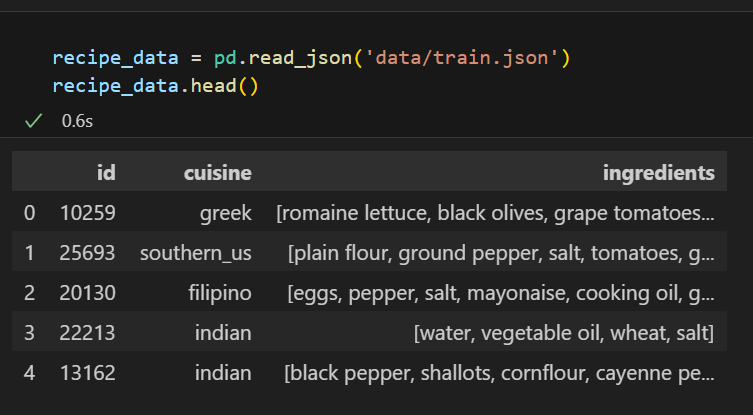
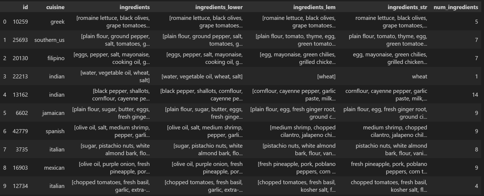
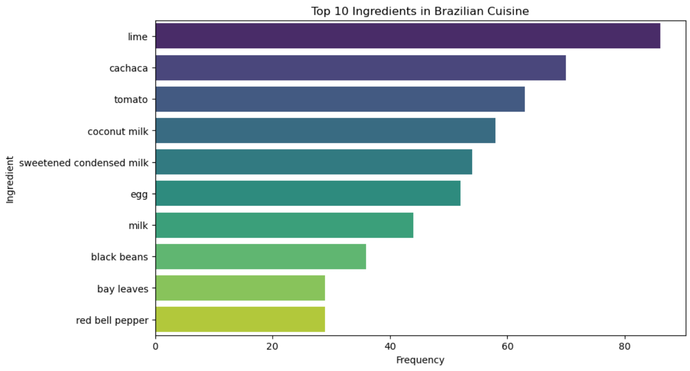
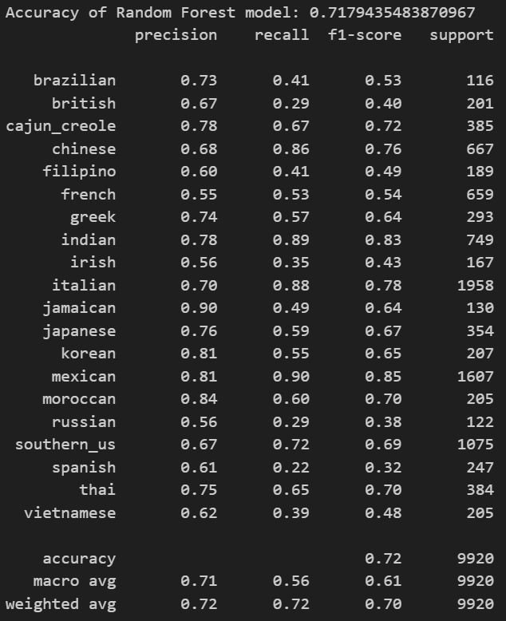
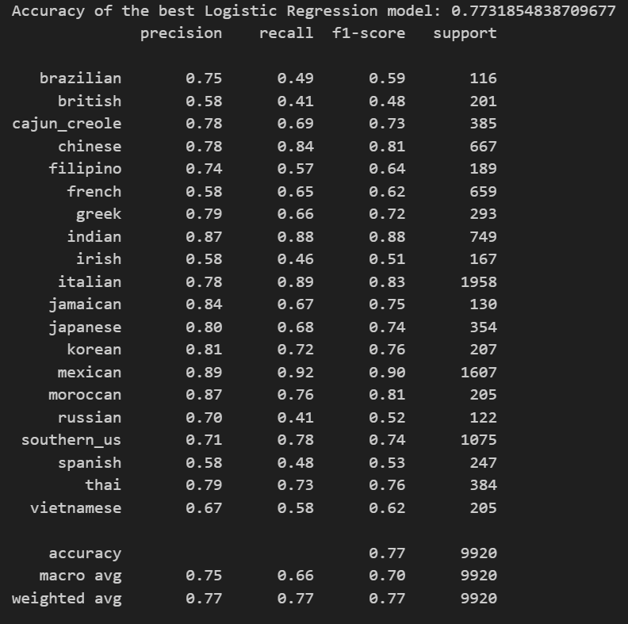

# Cuisine Predictor
A predictive model that takes a list of ingredients and classify the category of cuisine it belongs to
E.g. tumeric, vegetable stock, tomatoes, garam masala, naan, red lentils --> Prediction: Indian cuisine

## How to run the model
1. Download ZIP file or clone repository in CLI
2. Run cuisine-predictor.ipynb in VSCode (recommended) or other suitable code editors

## Skills
Python, Machine Learning (Random Forest, Logistic Regression)

## Folder Structure
- `data`: the folder containing raw data train.json and test.json to be extracted
- `images`: the folder containing images documenting the process from data cleaning, visualisation to classification reports
- `cuisine-predictor.ipynb`: the python notebook that contains the executable code

## Dependencies
- nltk
- numpy
- pandas
- seaborn
- matplotlib
- sklearn

## Summary of what the model does
1. Extract data from train.json

2. Prepare the data
Lemmatise, remove null values, duplicates & common ingredients eg.g. sugar, salt, pepper

3. Visualise the data
E.g. Top 10 ingredients used in brazilian cuisine

4. Apply machine learning models and generate classification reports
- Random Forest
    - Accuracy: 0.718

- Logistic Regression
    - Accuracy: 0.773

